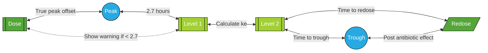

# Patient Calculations

## Data Validation
| Parameter | Condition | Value(s) |
|---|---|---|
| Weight | in range | `1` to `300` |
| Height | in range | `60` to `250` |
| Age | in range | `0.25` *(3 months)* to `120` |
| SCr | in range | `0.1` to `20` |
| Sex | one of | `M` `m` `F` `f` |

## Age

### Conversion to Years

- If entered as `#d` → age = d ÷ 365.25
- If entered as `#m` → age = m ÷ 12
- If entered as `#m#d` → age = (m ÷ 12) + (d ÷ 365.25)

### Age Context

*(for determining which fields to show or hide)*
| Condition | Age Context |
| --- | --- |
| If age < 1 year | infant |
| Else if age < 18 years | child |
| Else | adult |

## Body Mass Index

$$\mathrm{BMI}=\frac{\mathrm{wt}}{\left(\frac{\mathrm{ht}}{100}\right)^2}$$

> **wt** : weight in kg
>
> **ht** : height in cm

## Ideal Body Weight
$$\mathrm{IBW_{male}}=50+\left[ 2.3\times\left(\mathrm{ht}-60 \right )\right]$$

$$\mathrm{IBW_{female}}=45.5+\left[ 2.3\times\left(\mathrm{ht}-60 \right )\right]$$

> **ht** : height in inches

## AdjBW

Use ABW if ABW ≤ IBW, otherwise...

$$\mathrm{AdjBW}=\left[ 0.4\times \left(\mathrm{ABW}-\mathrm{IBW} \right ) \right ]+\mathrm{IBW}$$

## Percent Over or Under IBW

$$\mathrm{OverUnder}=\left(\frac{\mathrm{ABW}}{\mathrm{IBW}}-1 \right )\times 100%$$

## Lean Body Weight

$$\mathrm{LBW_{male}}=9270\times \left(\frac{\mathrm{ABW}}{6680+\left(216\times \mathrm{BMI} \right )} \right )$$

$$\mathrm{LBW_{female}}=9270\times \left(\frac{\mathrm{ABW}}{8780+\left(244\times \mathrm{BMI} \right )} \right )$$

## Body Surface Area

$$\mathrm{BSA}=\sqrt{\frac{\mathrm{ht}\times\mathrm{wt}}{3600}}$$

> **wt** : weight in kg
>
> **ht** : height in cm

## CrCl

### Cockroft-Gault

$$\mathrm{CrCl}=\frac{\left(140-\mathrm{age} \right )\times\mathrm{wt}}{\mathrm{SCr}\times 72}\ \ \ \mathrm{\ }\times0.85\mathrm{\ if\ female\ }$$

> **wt** : weight in kg

### Schwartz

$$\mathrm{CrCl}_{\mathrm{Schwartz}}=\frac{\mathrm{k}\times\mathrm{ht}}{\mathrm{SCr}}$$

> **ht** : height in cm

| Condition | k value |
| --- | --- |
| if age ≤ 1 and term infant | k = 0.45 |
| else if age ≤ 1 and LBW infant | k = 0.33 |
| else if age ≥ 13 and sex = M | k = 0.7 |
| else | k = 0.55 |

### Protocol CrCl

| Condition | Equation to Use |
| --- | --- |
| If age < 18 | use Schwartz |
| Else if actual weight < IBW | use C-G(actual) |
| Else if overUnder > 30 | use C-G(adjusted) |
| Else | use C-G(ideal) |

<!-- # TPN Calculations

## Daily fluid requirements

| Age | Daily fluid requirement |
| --- | --- |
| Adult < 56 yrs | 35 mL/kg |
| Adult 56-75 yrs | 30 mL/kg |
| Elderly > 75 yrs | 25 mL/kg | -->

# Vancomycin Protocol Dosing

## Configuration

### Maximum Doses

| Parameter | Value |
| --- | --- |
| Max initial TDD (non-HD) | 4500 mg |
| Max MD for HD patient | 2000 mg |
| Max MD for PD patient | 2000 mg |

### Data Validation

| Parameter | Condition | Value(s) |
|---|---|---|
| Dose | in range | `250` to `3000` |
| Frequency | in range | `6` to `48` |
| Level | in range | `3` to `100` |
| Time level drawn after dose | in range | `0` to `36` |

## Loading Dose

**Pediatric (non-obese):**

"Loading dose not recommended in non-obese pediatric patients"

**Pediatric with BMI > 95th percentile for age:**

"Consider loading dose of ` 20 mg/kg × ABW ` mg (BMI ≥ 95th percentile for age)"

**Adults (calculated using ABW)**

| **Adults** | Loading Dose (ABW) | Max LD |
| --- | --- | --- |
| Default | 25 mg/kg | 3 g |
| Sepsis | 25-35 mg/kg | 3 g |
| HD | 25 mg/kg | 3 g |
| PD | 25 mg/kg | 2 g |
| CRRT | 20-25 mg/kg | 3 g |
| SLED | 20-25 mg/kg | 3 g |

## Dose Rounding

**Age ≥ 18:** round to nearest 250 mg

**Age < 18:** round to nearest 25 mg for doses < 250 mg, otherwise round to nearest 250 mg

## Infusion Time

| Dose | Infusion Time ($\mathrm{T}$) |
| --- | --- |
| if dose > 2500 | 3 hours |
| else if dose > 2000 | 2.5 hours |
| else if dose > 1500 | 2 hours |
| else if dose > 1000 | 1.5 hours |
| else | 1 hour |

## Maintenance Dose

| Dialysis | CrCl | Age | Recommendation |
| --- | --- | --- | --- |
| non-HD | (any) | age < 12 | `60-80 mg/kg/day divided q6h` |
| non-HD | (any) | age < 18 | `60-70 mg/kg/day divided q6h` or  `60-70 mg/kg/day divided q8h` |

:pushpin: To Do

# Vancomycin Dosing Equations

## Initial Dosing (Trough Method)

### Volume of Distribution (Vd)

**If BMI < 40:** Vd = ABW x 0.5

**If BMI ≥ 40:** Vd = ABW x 0.7

### Vancomycin Clearance (CL)

*using protocol CrCl*

$$\mathrm{CL}=\left [ \left (0.695 \times \mathrm{CrCl} \right ) + 0.05\right ]\times 0.06$$

### Elimination Rate Constant ($ke$)
$$ke=\frac{\mathrm{CL}}{\mathrm{V_{d}}}$$

### Halflife ($t_\frac{1}{2}$)

$$\mathrm{t}_{\frac{1}{2}}=\frac{\ln(2)}{ke}$$

### Suggested Interval ($τ$)

| Condition | Value |
| --- | --- |
| if halflife < 7 | q6h |
| else if halflife < 10 | q8h |
| else if halflife < 15 | q12h |
| else if halflife < 21  | q18h |
| else if halflife < 36 | q24h |
| else | q48h |

### Peak and Trough

Calculate for each possible dose (500-2000 mg):

$$\mathrm{C_{max}}=\frac{\mathrm{D}}{\mathrm{T}}\times\frac{1-e^{-ke\times \mathrm{T}}}{\mathrm{V_{d}}\times ke \times \left ( 1-e^{-ke\times \tau } \right )}$$

$$\mathrm{C_{min}}=\mathrm{C_{max}}\times e^{-ke\: \times\, (\tau - T)}$$

Suggested dose is the lowest dose where the predicted trough is greater than or
equal to the low end of goal range and less than or equal to the high end of the
goal range.  Uses the goal from the “monitoring” section above.  If the goal is
an AUC range, uses trough 10-20 for this determination (10-15 for peds).

## Initial Dosing (AUC Method)

### Elimination Rate Constant - Matzke Method (ke)

$$ke=(0.00083\times \mathrm{CrCl})+0.0044$$

### Halflife ($t_\frac{1}{2}$)

$$\mathrm{t}_{\frac{1}{2}}=\frac{\ln(2)}{ke}$$

### Vancomycin Clearance (CL)

**Use Matzke method if BMI > 30**

$$\mathrm{CL}=\mathrm{V_d}\times\mathrm{ke}$$

**Use Crass method if BMI ≤ 30**

$$\mathrm{CL}=\left (9.656-0.078\times \mathrm{age} \right ) - \left(2.009 \times \mathrm{SCr} \right ) + \left ( 1.09 \times \mathrm{sex} \right ) + \left ( 0.04 \times \mathrm{wt}^{0.75} \right )$$

> **sex** : 1 for male, 0 for female

### Recommended Interval ($\tau$)

$$\tau = \mathrm{t}_{\frac{1}{2}}+\mathrm{T}$$

> **T** : *infusion time*

### Recommended Total Daily Dose (TDD)

$$\mathrm{TDD}=\mathrm{CL}\times \mathrm{AUC_{goal}}$$

### Recommended Dose (D)

$$\mathrm{D}=\mathrm{TDD}\times\frac{\tau}{24}$$

## Dose Revision

### Linear

#### New Dose

$$\mathrm{D}_{2}=\left ( \frac{\mathrm{D}_{1}}{\mathrm{C}_{1}}\times\mathrm{C}_{2} \right )+125$$

> $C_2$ : Desired trough = middle of selection range

#### Expected Trough

$$\mathrm{C}_{2}=\frac{\mathrm{D}_{2}}{\mathrm{D}_{1}}\times\mathrm{C}_{1}$$

### Single Level (Trough) Revision

#### Calculated Elimination Rate Constant (ke)
$$ke=\frac{\ln\left(\frac{\left[\left(\frac{\mathrm{dose}}{\mathrm{V_{d}}} \right ) + \mathrm{C}_{\mathrm{result}}\right ]}{\mathrm{C_{result}}} \right )}{\left(\tau -\mathrm{T_{trough}} \right )}$$

> $\mathrm{T}_\mathrm{trough}$ : hours drawn before next infusion

#### Estimated Trough

$$\mathrm{C_{est.trough}}=\mathrm{C_{result}}\times e^{-ke\;\times\,\mathrm{T_{trough}}}$$

#### Estimated Peak

$$\mathrm{C_{est.peak}}=\frac{\mathrm{C_{est.trough}}}{e^{-ke\;\times\,\left(\tau -\mathrm{T_{inf}}-\mathrm{T_{trough}} \right )}}$$

#### Halflife ($t_\frac{1}{2}$)

$$\mathrm{t}_{\frac{1}{2}}=\frac{\ln(2)}{ke}$$

#### Recommended New Frequency

$$\tau_{\mathrm{new}}=\mathrm{T_{inf}}+ \left ( \frac{\ln\frac{\mathrm{C_{trough.goal}}}{\mathrm{C_{peak.goal}}}}{-ke} \right )$$

*Uses fixed goal peak of 35 mcg/mL*

| $\tau_\mathrm{new}$ | Round to |
| ------------- | ----------------- |
| < 7 | q6h |
| < 10 | q8h |
| < 16 | q12h |
| < 21 | q18h |
| < 36 | q24h |
| else | q48h |

#### Remainder of calculations

Use calculated ke in same equations/process as [initial PK dosing](#peak-and-trough)

### Two-Level PK

#### Elimination Rate Constant (ke)

$$ke=\frac{e^{\frac{\mathrm{C}_1}{\mathrm{C}_2}}}{\mathrm{T}_1-\mathrm{T_2}}$$

#### Remainder of calculations

Use calculated ke in same equations/process as [initial PK dosing](#peak-and-trough)

### AUC Calculation - Current Dose

$$ke=\frac{-e^{\frac{\mathrm{C_{max}}}{\mathrm{C_{min}}}}}{\mathrm{T_{min}}-\mathrm{T_{max}}}$$

$$\mathrm{C_{true\,max}}=\frac{\mathrm{C_{max}}}{e^{-ke\;\times\,\left(\mathrm{T_{max}}-\tau \right )}}$$

$$\mathrm{C_{true\,min}}=\mathrm{C_{min}\times e^{-ke\;\times\,\left(\tau -\mathrm{T_{min}} \right )}}$$

$$\mathrm{AUC_{inf}}=\left(\mathrm{C_{true\,max}+\mathrm{C_{true\,min}}} \right )\times\frac{\mathrm{T}}{2}$$

$$\mathrm{AUC_{elim}}=\frac{\mathrm{C_{true\,max}-\mathrm{C_{true\,min}}}}{ke}$$

$$\mathrm{AUC}_{24}=\left(\mathrm{AUC_{inf}} + \mathrm{AUC_{elim}} \right )\times \frac{24}{\tau}$$

$$\mathrm{V_d}=\frac{\mathrm{dose}}{\mathrm{T}}\times\frac{1-e^{-ke\;\times\,\tau}}{ke\times \left[\mathrm{C_{true\,max}} -\left(\mathrm{C_{true\,min}\times e^{-ke\;\times\,\tau}} \right )\right ]}$$

### AUC Calculation - New Dose

$$\mathrm{AUC}=\mathrm{AUC_{24}}\times\frac{\mathrm{TDD_{new}}}{\mathrm{TDD_{old}}}$$

$$\mathrm{C_{max}}=\frac{\mathrm{D}}{\mathrm{T}}\times \frac{1-e^{-ke\times\,\mathrm{T}}}{\mathrm{V_d}\times ke\times\left(1-e^{-ke\;\times\,\tau} \right )}$$

> D : new dose

$$\mathrm{C_{min}}=\mathrm{C_{max}}\times e^{-ke\;\times\,\left(\tau -\mathrm{T} \right )}$$

# Aminoglycoside Dosing

## Dosing Weight
Adjusted weight is the standard AdjBW, using factor of 0.4)

| Condition                    | Weight to Use                  |
| ---------------------------- | ------------------------------ |
| if age < 15                  | n/a - guideline does not apply |
| else if overUnder > 20       | use adjusted wt                |
| else if actual wt < ideal wt | use actual wt                  |
| else                         | use ideal weight               |

### Alternate Aminoglycoside Dosing Weight

Used for patients with cystic fibrosis or who are pre- or postpartum.

| Condition              | Weight to Use                  |
| ---------------------- | ------------------------------ |
| if age < 15            | n/a - guideline does not apply |
| else if overUnder > 20 | use adjusted wt                |
| else                   | use actual wt                  |

## Extended Interval Dosing

### Standard (non-Cystic Fibrosis) Calculations

- Infusion time $T$ assumed to be `1 hour`
- Time to complete distribution assumed to be `1.7 hours`
- Goal trough is:
  - **2 mcg/mL** for gentamicin and tobramycin
  - **4 mcg/mL** for amikacin

**Calculated ke**:&nbsp;&nbsp;&nbsp;&nbsp;
$\frac{\ln{\left(\frac{\mathrm{level}_1}{\mathrm{level}_2}\right)}}{\mathrm{time\ between\ levels}}$

**Estimated Vd**:&nbsp;&nbsp;&nbsp;&nbsp;
$\frac{\mathrm{dose}}{\mathrm{true\ peak}}$

**Calculated (true) peak**:&nbsp;&nbsp;&nbsp;&nbsp;
$\frac{\mathrm{level}_1}{e^{-(\mathrm{time}_1-2.7)\ \times \ ke}}$

**Time to goal trough (MIC)**:&nbsp;&nbsp;&nbsp;&nbsp;
$\frac{\ln{\left(\frac{\mathrm{level}_1}{\mathrm{level}_2}\right)}}{-ke}$

**Level at redose point**:&nbsp;&nbsp;&nbsp;&nbsp;
$e^{-ke \times \left( \mathrm{Time\ to\ goal\ trough}+\mathrm{Post\ antibiotic\ effect}\right)}\times\mathrm{level}_2$

**Peak to trough time**:&nbsp;&nbsp;&nbsp;&nbsp;
$\frac{\ln{\left(\frac{\mathrm{goal\ trough}}{\mathrm{goal\ peak}}\right)}}{-ke}$

**New dose to redose time**:&nbsp;&nbsp;&nbsp;&nbsp;
Peak to trough time + Post antibiotic effect + 2.7

**Recommended dose**:&nbsp;&nbsp;&nbsp;&nbsp;
$\frac{\mathrm{goal\ peak}}{\mathrm{true\ peak}}\times\mathrm{dose}$

**Recommended frequency**:&nbsp;&nbsp;&nbsp;&nbsp;
Round `New dose to redose time` to nearest 12 hours

**Point level estimate**:&nbsp;&nbsp;&nbsp;&nbsp;
$e^{-ke \times \left( \mathrm{Time\ from\ level_2\ to\ custom\ time}\right)}\times\mathrm{level}_2$

### Cystic Fibrosis Calculations

- Infusion time $T$ assumed to be `1 hour`
- Goal trough is: **Undetectable**
- Goal Peak is:
  - **20-30 mcg/mL** for tobramycin
  - **35-50 mcg/mL** for amikacin
- Goal AUC is:
  - **&lt; 101 mg&middot;hr/L** for q24h tobramycin 
  - **n/a** for amikacin and other tobramycin frequencies

**Calculated ke**:&nbsp;&nbsp;&nbsp;&nbsp;
$\frac{\ln{\left(\frac{\mathrm{level}_1}{\mathrm{level}_2}\right)}}{\mathrm{time\ between\ levels}}$

**Halflife**:&nbsp;&nbsp;&nbsp;&nbsp;
$\frac{0.693}{ke}$

**Predicted peak**:&nbsp;&nbsp;&nbsp;&nbsp;
$\mathrm{level_1}\div e^{-ke\times\left(\mathrm{time_1}-T\right)}$

> $\mathrm{time_1}$ : time from dose to first level

**Predicted trough**:&nbsp;&nbsp;&nbsp;&nbsp;
$\mathrm{level_2}\times e^{-ke\times\left(\tau-\mathrm{time_2}\right)}$

> $\mathrm{time_2}$ : time from dose to second level  
> $\tau$ : frequency

**Calculated AUC**:&nbsp;&nbsp;&nbsp;&nbsp;
$\frac{\mathrm{predicted\ peak}-\mathrm{predicted\ trough}}{ke}$

# Corrected QT Interval

## Atrial Fibrillation

QTc = average of longest and shortest QT intervals from EKG

## Not Atrial Fibrillation

$RR=\frac{60}{HR}$

If QRS > 120, adjust QT first using the Modified Bogossian formula, then use that value in the Bazett, Fridericia, or Framingham formula.

**Modified Bogossian formula**:&nbsp;&nbsp;&nbsp;&nbsp;
$QT^\prime=QT-0.5(\mathrm{QRS})$

Corrected QT is calculated using:

| Heart Rate | Formula    | Equation                              |
| ---------- | ---------- | ------------------------------------- |
| < 50       | Fridericia | $QT_c=\frac{QT^\prime}{\sqrt[3]{RR}}$ |
| 50-70      | Bazett     | $QT_c=\frac{QT^\prime}{\sqrt{RR}}$    |
| > 70       | Framingham | $QT_c=QT^\prime+154(1-RR)$            |
